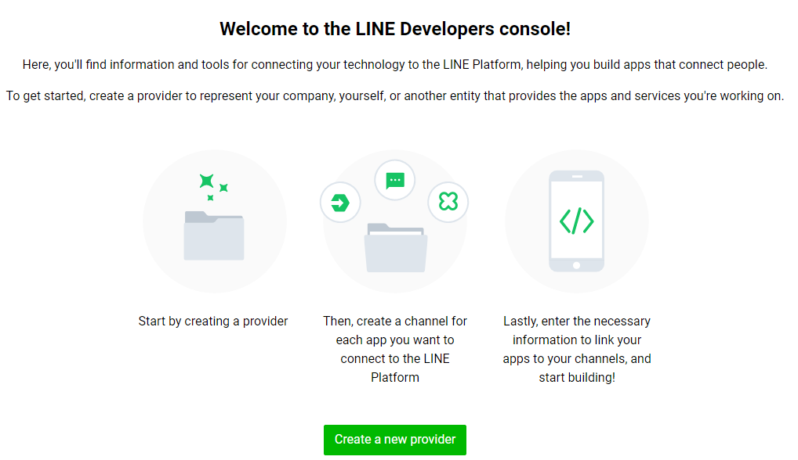

# Day2 

這篇教如何建立line bot,與其對應的試圖函數


## 建立 LINE Developers

前往<a href = "https://developers.line.biz/zh-hant/">LINE Developers</a>,點選登入並使用使用LINE帳號登入
會看到如下圖的畫面，輸入姓名及電子郵件即可，目的在於讓開發人員同意使用規範與聯絡使用


建立完成如下

## 建立Messaging API channel

點選Creating a Messaging API cHANNEL


開始填入相關資料


取得Channel secret記錄起來


取得Channel ACCESS TOKEN,記錄起來


## setting.py 新增LINE Bot憑證
將剛剛得到的最後取得Channel,Channel ACCESS TOKEN填在setting.py
```
LINE_CHANNEL_ACCESS_TOKEN = 'Messaging API的Channel access token'
 
LINE_CHANNEL_SECRET = 'Basic settings的Channel Secret'
```

## Django 建立LINE Bot後台
views.py建立後台執行的函數,當訊息送出後就會跑到這個函數
```python 
from django.shortcuts import render
from django.http import HttpResponse, HttpResponseBadRequest, HttpResponseForbidden
from django.views.decorators.csrf import csrf_exempt
from django.conf import settings
 
from linebot import LineBotApi, WebhookParser
from linebot.exceptions import InvalidSignatureError, LineBotApiError
from linebot.models import MessageEvent, TextSendMessage,StickerSendMessage,ImageSendMessage
 
line_bot_api = LineBotApi(settings.LINE_CHANNEL_ACCESS_TOKEN)
parser = WebhookParser(settings.LINE_CHANNEL_SECRET)
 
 
@csrf_exempt
def callback(request): 
    if request.method == 'POST':        
        signature = request.META['HTTP_X_LINE_SIGNATURE']
        body = request.body.decode('utf-8') 
        try:
            events = parser.parse(body, signature)  # 傳入的事件
        except InvalidSignatureError:
            return HttpResponseForbidden()
        except LineBotApiError:
            return HttpResponseBadRequest()
 
        for event in events:
            print(event.message.type)
            if isinstance(event, MessageEvent):  # 如果有訊息事件
                if event.message.type=='text':  
                    line_bot_api.reply_message(  # 回復傳入的訊息文字
                        event.reply_token,                       
                        TextSendMessage(text=event.message.text)
                    )  
        return HttpResponse()
    else:
        return HttpResponseBadRequest()
```

urls.py 建立相對應callback函數的網址

```python
from django.urls import path
from . import views
 
urlpatterns = [
    path('callback', views.callback)
]

```


## Install Ngrok

需要讓網址能夠公開(Public)且具有HTTPS，LINE頻道(Channel)才有辦法連結。

可以將LINE Bot應用程式(APP)部署到像Heroku，還可以使用Ngrok。Ngrok。是能夠將你本機的IP埠號(http://127.0.0.1:8000)，對應到一個隨機產生的HTTPS網址，並且這個HTTPS網址是對外公開的的，

進入網站註冊後會得到一個authtoken

```
    ngrok authtoken your_authtoken
```
執行下面這行指令,80為port,可自行修改,但必須與django port 對應
```
    ngrok http 80
```
得到HTTPS網址<br>


## LINE Webhook URL
有了url跟https,就可以在line 建立連結,對應的網址填入,並將webhook啟用


並點auto-reply messages修改設定


## 結果


