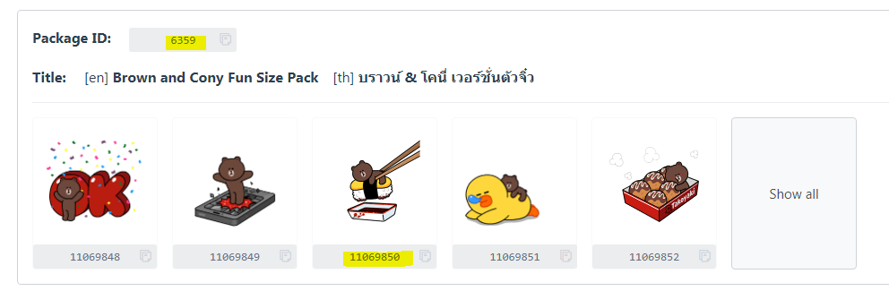
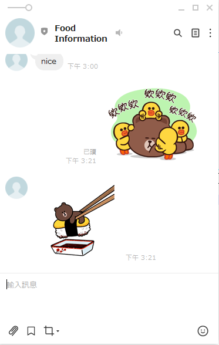

# Day3 

上一張使用TextSendMessage傳送文字,這次介紹傳送其他類型的方法

```
from linebot.models import StickerSendMessage, TextSendMessage,StickerSendMessage,ImageSendMessage
```

## 傳送文字TextSendMessage
text 為要傳送的文字

```                    
    TextSendMessage(text=event.message.text) 
```

## 傳送貼圖StickerSendMessage
StickerSendMessage 有2個參數package_id,sticker_id,可以由 <a href = "https://developers.line.biz/en/docs/messaging-api/sticker-list/#sticker-definitions">網址</a>取得,參考如下


```
    StickerSendMessage(package_id=6359, sticker_id=11069850)
```

結果如下


## 傳送圖片ImageSendMessage
只能傳送含有網址的圖片,有2個參數如下

<li>original_content_url:表示原圖的網址</li>
<li>preview_image_url:預覽圖的網址</li>


```python
    ImageSendMessage(
        original_content_url = 'https://res.klook.com/image/upload/c_fill,w_960,h_460,f_auto/w_80,x_15,y_15,g_south_west,l_klook_water/activities/cmyvmrvbcil7awimgwt0.webp',
        preview_image_url = 'https://res.klook.com/image/upload/c_fill,w_960,h_460,f_auto/w_80,x_15,y_15,g_south_west,l_klook_water/activities/cmyvmrvbcil7awimgwt0.webp'
    )
```


