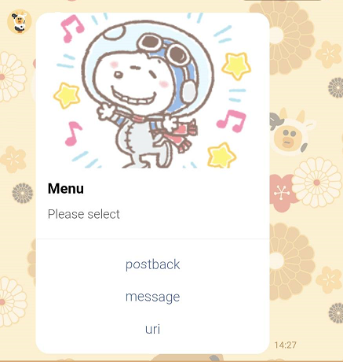

# Day3

之前使用line 文字傳遞訊息的方法,還有以下格式
<ul>
    <li>文字</li>
    <li>貼圖</li>
    <li>圖片</li>
    <li>影片</li>
    <li>聲音</li>
    <li>位置</li>
    <li>影像地圖</li>
    <li>模板</li>
</ul>

下面為可能會import 到的
```python
from linebot.models import (ButtonsTemplate, CarouselColumn, CarouselTemplate,
                            ConfirmTemplate, ImagemapSendMessage,
                            ImageSendMessage, LocationSendMessage,
                            MessageEvent, MessageTemplateAction,
                            PostbackTemplateAction, StickerSendMessage,
                            TemplateSendMessage, TextSendMessage,
                            URITemplateAction, VideoSendMessage)
```

## 文字
使用TextSendMessage,text 為要傳送的文字

```python                    
    TextSendMessage(text=event.message.text) 
```

## 貼圖

使用StickerSendMessage函數,有2個參數如下

<li>package_id:貼圖package id</li>
<li>sticker_id:貼圖 id</li>

<a href = "https://developers.line.biz/en/docs/messaging-api/sticker-list/#sticker-definitions">網址</a>取得,參考如下


```python
    StickerSendMessage(package_id=6359, sticker_id=11069850)
```

結果如下


## 圖片
使用ImageSendMessage函數,只能傳送含有網址的圖片,有2個參數如下

<li>original_content_url:表示原圖的網址</li>
<li>preview_image_url:預覽圖的網址</li>


```python
    ImageSendMessage(
        original_content_url = 'https://res.klook.com/image/upload/c_fill,w_960,h_460,f_auto/w_80,x_15,y_15,g_south_west,l_klook_water/activities/cmyvmrvbcil7awimgwt0.webp',
        preview_image_url = 'https://res.klook.com/image/upload/c_fill,w_960,h_460,f_auto/w_80,x_15,y_15,g_south_west,l_klook_water/activities/cmyvmrvbcil7awimgwt0.webp'
    )
```


## 影片

使用VideoSendMessage,有2個參數如下

<li>original_content_url:影片網址</li>
<li>preview_image_url:預覽圖的網址</li>


```python
    VideoSendMessage(
        original_content_url='https://example.com/original.mp4',
        preview_image_url='https://example.com/preview.jpg'
    )
```

## 聲音

AudioSendMessage,有2個參數如下

<li>original_content_url:網址</li>
<li>duration:時間</li>


```python
     AudioSendMessage(original_content_url='音訊網址', duration=100000)
```

## 位置
```
    LocationSendMessage(
        title='my location', 
        address='Taipei', 
        latitude=25.02, 
        longitude=121.32
     )
```

## 影像地圖


## 模板


首先先介紹Template 會用到幾個Action
<ul>
    <li>MessageTemplateAction:label 為顯示文字,text表示輸出給使用者的文字</li>
    <li>PostbackTemplateAction:與上面差別多了傳回data</li>
    <li>URITemplateAction</li>
</ul>


### ButtonsTemplate

```python
    message = TemplateSendMessage(
        alt_text='Buttons template',
        template = ButtonsTemplate(
            thumbnail_image_url='https://stickershop.line-scdn.net//stickershop//v1//sticker//207700639//android//sticker.png',
            title='Menu',
            text='Please select',
            actions=[
                        PostbackTemplateAction(
                            label='postback',
                            text='postback text',
                            data='action=buy&itemid=1'
                        ),
                        MessageTemplateAction(
                            label='message',
                            text='message text'
                        ),
                        URITemplateAction(
                            label='uri',
                            uri='http://example.com/'
                        )
                    ]
        )
    )
```


### Confirm Template
```python
    message = TemplateSendMessage(
        alt_text='Buttons template',
        template = ConfirmTemplate(
            
            title='ConfirmTemplate',
            text='click yes or no',
            actions=[
                PostbackTemplateAction(
                    label='yes',
                    text='postback text',
                    data='action=buy&itemid=1'
                ),
                MessageTemplateAction(
                    label='No',
                    text='message text'
                ),
            ]
        )
    )
```

### CarouselTemplate
就是可以多個ButtonsTemplate

```python
    message = TemplateSendMessage(
        alt_text = 'CarouselTemplate',
        template = CarouselTemplate(
            columns=[
                CarouselColumn(
                    thumbnail_image_url='https://stickershop.line-scdn.net//stickershop//v1//sticker//207700639//android//sticker.png',
                    title='this is menu1',
                    text='description1',
                    actions=[
                        PostbackTemplateAction(
                            label='postback1',
                            text='postback text1',
                            data='action=buy&itemid=1'
                        ),
                        MessageTemplateAction(
                            label='message1',
                            text='message text1'
                        ),
                        URITemplateAction(
                            label='uri2',
                            uri='http://example.com/1'
                        )
                    ]
                ),   
                CarouselColumn(
                    thumbnail_image_url='https://stickershop.line-scdn.net//stickershop//v1//sticker//207700649//android//sticker.png',
                    title='this is menu1',
                    text='description1',
                    actions=[
                        PostbackTemplateAction(
                            label='postback2',
                            text='postback text2',
                            data='action=buy&itemid=1'
                        ),
                        MessageTemplateAction(
                            label='message2',
                            text='message text2'
                        ),
                        URITemplateAction(
                            label='uri2',
                            uri='http://example.com/1'
                        )
                    ]
                ),                        

            ]
        )
    )
    line_bot_api.reply_message(  # 回復傳入的訊息文字
        event.reply_token,                       
        message                        
    )  
```

