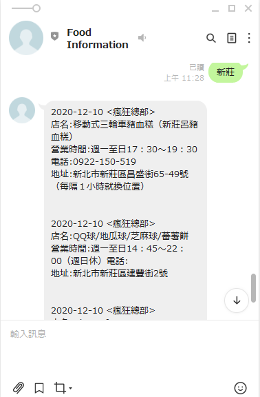
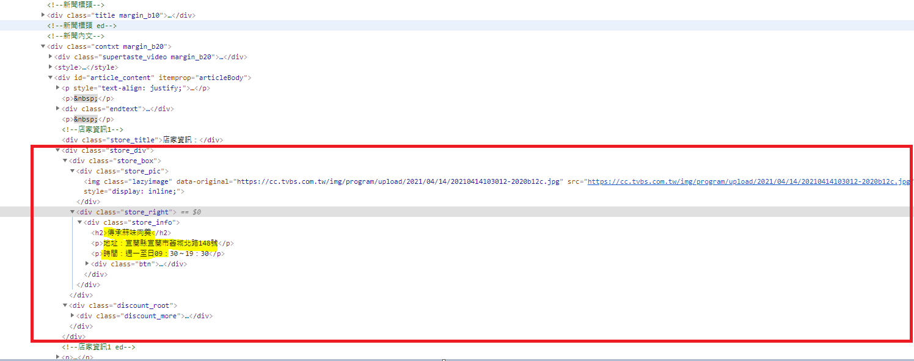
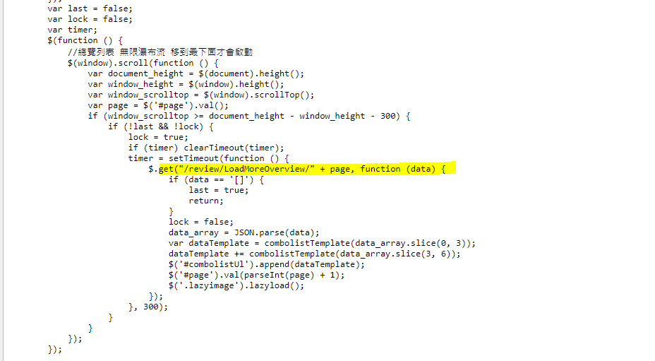
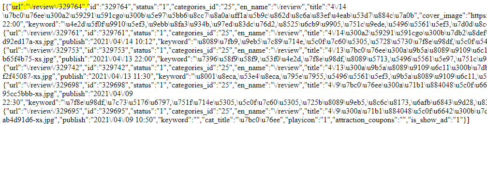

# Day4 爬蟲


建立可以查附近食尚玩家有介紹的店,透過網路爬蟲建立資料

## scrapy

首先我們建立基本的爬蟲,在cmd 底下下
```
    scrapy startproject example
```

接著進入example\spiders,在cmd下下列指令
```
    scrapy genspider supertaste https://supertaste.tvbs.com.tw/review
```
會產生supertaste.py
```python
class SupertasteSpider(scrapy.Spider):
    name = 'supertaste'
    allowed_domains = ['https://supertaste.tvbs.com.tw/review']
    start_urls = ['http://https://supertaste.tvbs.com.tw/review/']

    def parse(self, response):
        pass
```

我們想取得連結,可以從div class ="box"底下ul li a取得




取得內部資料


```python
    image_url = store.css('img.lazyimage::attr(data-original)').get()
    name = store.css('div.store_info h2::text').get()           
    address = self.get_array_data(store.css('div.store_info p::text').re(r'地址：(.*)'))
    business_hours = self.get_array_data(store.css('div.store_info p::text').re(r'時間：(.*)'))
    telephone = self.get_array_data(store.css('div.store_info p::text').re(r'電話：(.*)'))  
```


code 如下
```python
import scrapy


class SupertasteSpider(scrapy.Spider):
    name = 'supertaste'
    start_urls = ['https://supertaste.tvbs.com.tw/review/']

    def parse(self, response):
        detail_links = response.css('div.box ul li a')        
        yield from response.follow_all(detail_links, self.parse_detail)
        
    def get_array_data(self,array):      
        return array[0] if array else ""
    
    def parse_detail(self, response):  
        date,show_name = response.css('div.newsdetail_content div.title h1::text').re(r'(\d+/\d+).*?《(.*?)》')           
        
        for store in response.css('div.store_div'):
            image_url = store.css('img.lazyimage::attr(data-original)').get()
            name = store.css('div.store_info h2::text').get()           
            address = self.get_array_data(store.css('div.store_info p::text').re(r'地址：(.*)'))
            business_hours = self.get_array_data(store.css('div.store_info p::text').re(r'時間：(.*)'))
            telephone = self.get_array_data(store.css('div.store_info p::text').re(r'電話：(.*)'))  
            if '食尚玩家購物網' in name:
                continue
            
            yield {
                'date' : date,
                'show_name' :  show_name,
                'name' :  name,
                'image_url' : image_url,
                'address' : address,
                'business_hours' :  business_hours,          
                'telephone' :  telephone,
                #'points' : points
            }
            
```

## 如何取得下一頁 
由於此網頁是藉由滾動到底部才產生新的內容,檢查一下網頁原始碼,可以發現是藉由觸發事件在去/review/LoadMoreOverview/page觸發



接著我們連進去https://supertaste.tvbs.com.tw/review/LoadMoreOverview/1,可以發現網頁內容是json格式,有明顯url的keyword



```python
class SupertasteSpider(scrapy.Spider):
    name = 'supertaste'
    start_urls = ["https://supertaste.tvbs.com.tw/review/LoadMoreOverview/%s" %page for page in range(1,66)]

    def parse(self, response):
        #read html as json
        
        datas = json.loads(response.body.decode('utf-8'))
        detail_links = [data['url'] for data in datas]     
        yield from response.follow_all(detail_links, self.parse_detail)       
    ....
```

start_urls也可以用start_requests取代
```python
    def start_requests(self):       
        for page in range(1,66):
            url = "https://supertaste.tvbs.com.tw/review/LoadMoreOverview/%s" %page
            yield scrapy.Request(url)    
```


