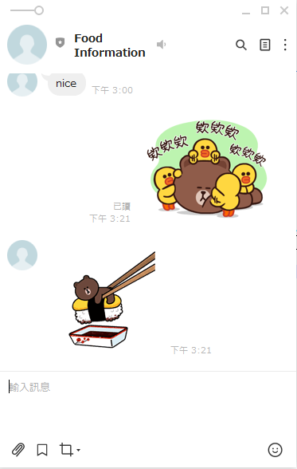
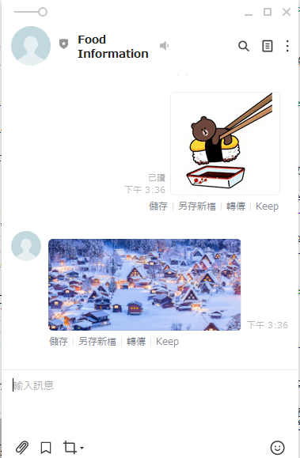

# Day5

之前使用line 文字傳遞訊息的方法,還有以下格式
<ul>
    <li>文字</li>
    <li>貼圖</li>
    <li>圖片</li>
    <li>影片</li>
    <li>聲音</li>
    <li>位置</li>
    <li>影像地圖</li>
    <li>模板</li>
</ul>

```python
from linebot.models import StickerSendMessage, TextSendMessage,StickerSendMessage,ImageSendMessage
```

## 文字
使用TextSendMessage,text 為要傳送的文字

```python                    
    TextSendMessage(text=event.message.text) 
```

## 貼圖

使用StickerSendMessage函數,有2個參數如下

<li>package_id:貼圖package id</li>
<li>sticker_id:貼圖 id</li>

<a href = "https://developers.line.biz/en/docs/messaging-api/sticker-list/#sticker-definitions">網址</a>取得,參考如下


```python
    StickerSendMessage(package_id=6359, sticker_id=11069850)
```

結果如下


## 圖片
使用ImageSendMessage函數,只能傳送含有網址的圖片,有2個參數如下

<li>original_content_url:表示原圖的網址</li>
<li>preview_image_url:預覽圖的網址</li>


```python
    ImageSendMessage(
        original_content_url = 'https://res.klook.com/image/upload/c_fill,w_960,h_460,f_auto/w_80,x_15,y_15,g_south_west,l_klook_water/activities/cmyvmrvbcil7awimgwt0.webp',
        preview_image_url = 'https://res.klook.com/image/upload/c_fill,w_960,h_460,f_auto/w_80,x_15,y_15,g_south_west,l_klook_water/activities/cmyvmrvbcil7awimgwt0.webp'
    )
```


## 影片

## 聲音


## 位置


## 影像地圖


## 模板


