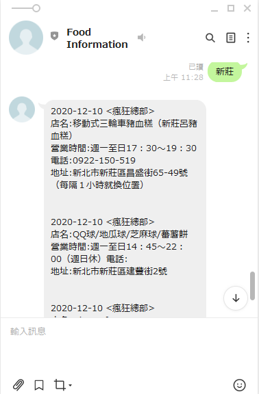

# Day5 建立資料庫和簡單Line查尋資料


## 建立資料庫
上一篇我們抓取了資料,現在我們建立對應的資料庫來儲存


line\models.py
```python 
from django.db import models


class Restaurant(models.Model):
    date = models.DateField(auto_now=False, auto_now_add=False)
    show_name = models.CharField(max_length = 500,null = False,blank = False) 
    url = models.CharField(max_length = 500,null = False,blank = False)      
    name = models.CharField(max_length = 500,null = False,blank = False)  
    image_url = models.CharField(max_length = 500,null = False,blank = False) 
    address = models.CharField(max_length = 500,null = False,blank = False)
    telephone = models.CharField(max_length = 500,null = False,blank = False)  
    business_hours  = models.TextField(max_length = 500,null = False,blank = False) 
```

在cmd輸入以下兩行,更新資料庫
```
    python manage.py makemigrations
    python manage.py migrate
```


接著寫一個將資料填入資料庫的py檔,也可以透過django 和scrapy 設定,並寫pipeline 來儲存資料,這邊用簡單一點的方法


在demoLinebot新增update_supertaste.py,並執行<br>


```python
import json
import os, django

#設定django 環境
os.environ.setdefault("DJANGO_SETTINGS_MODULE", "demoLinebot.settings")
django.setup()

from line.models import Restaurant
import csv
from datetime import datetime
from django.db import transaction

#@transaction.atomic  可以不使用,使用速度比較快
@transaction.atomic 
def main():
    with open('supertaste.csv',encoding = 'utf-8') as csvfile:
        rows = csv.reader(csvfile, delimiter=',')
        next(rows, None)//first row is header
        for row in rows:
            str_date,show_name,url,name,image_url,address,business_hours,telephone = row  
            date = datetime.strptime(str_date, "%Y/%m/%d").date()            
            restaurant,created = Restaurant.objects.get_or_create(url = url, name = name,date = date)
            restaurant.url = url
            restaurant.name = name
            restaurant.show_name = show_name
            restaurant.image_url = image_url
            restaurant.address = address
            restaurant.business_hours = business_hours
            restaurant.telephone = telephone
            restaurant.date = date
            restaurant.save()
main()
```

## 輸入縣市得到資訊

建立一個去資料庫收尋地址相關的關鍵字,並回傳餐廳資訊
```python
def get_restaurant(keyword):
    restaurants = Restaurant.objects.filter(address__icontains = keyword)[:5]
    content = ""
    for restaurant in restaurants:
        content += "{0} <{1}>\n".format(restaurant.date,restaurant.show_name)
        content += "店名:{0}\n".format(restaurant.name)
        content += "營業時間:{0}\n".format(restaurant.business_hours)
        content += "電話:{0}\n".format(restaurant.telephone)
        content += "地址:{0}\n".format(restaurant.address)
        content += "\n\n"
    return content if content else "目前沒有資料"
```
修改原本的訊息內容
```python
@csrf_exempt
def callback(request):
....
                if event.message.type=='text':  
                    line_bot_api.reply_message(  # 回復傳入的訊息文字
                        event.reply_token,                       
                        #TextSendMessage(text=event.message.text)
                        TextSendMessage(text=get_restaurant(event.message.text))
                     )

....
```





