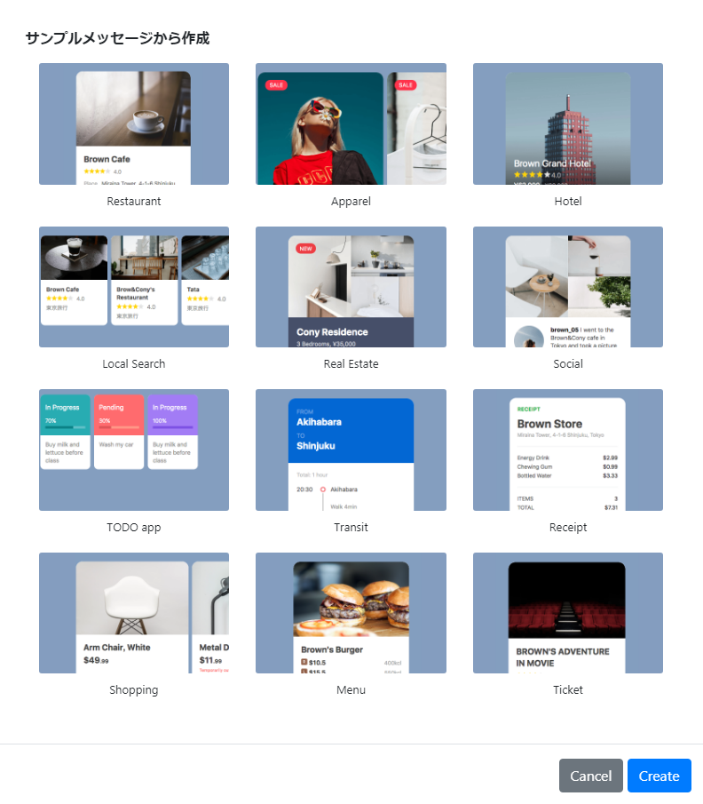
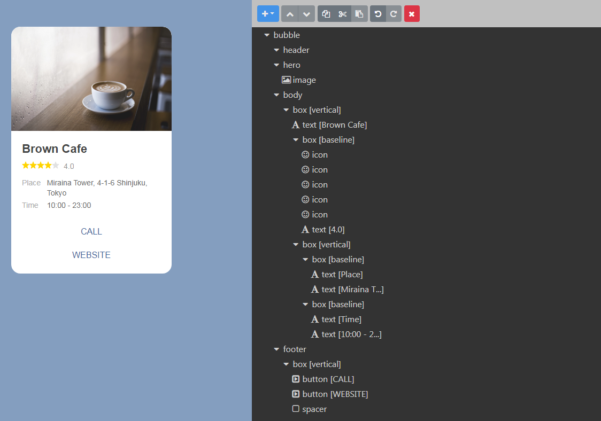
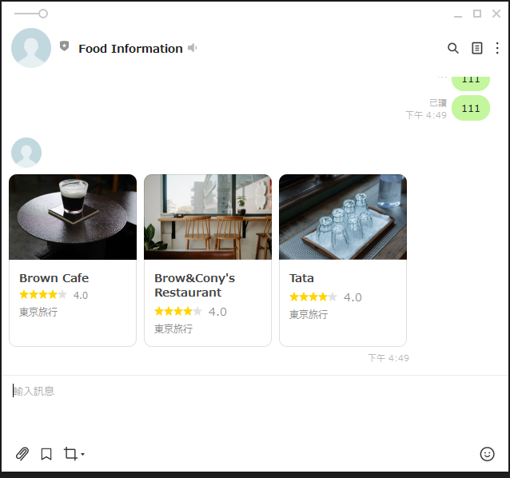

# Flex Message

可以建立,屬於自己格式的訊息,<a href = "https://developers.line.biz/en/docs/messaging-api/using-flex-messages/">官方</a>提供的範例如下：




由下圖可知主要分四塊
<ul>
    <li>header設定上方的標題內容</li>
    <li>hero設定圖片內容</li>
    <li>body設定主要內容</li>
    <li>footer設定底部內容</li>
<ul>



## 如何使用
點選View as JSON將裡面代碼複製,並將true,false,改成True,False,

這邊要使用FlexSendMessage,有2個參數如下

<li>alt_text:line預覽的文字</li>
<li>contents:傳的內容</li>

contents就是剛剛得到的View as JSON代碼


```python
def flex_test():
   
    content ={
            "type": "carousel",
            "contents": [
                {
                "type": "bubble",
                "size": "micro",
                "hero": {
                    "type": "image",
                    "url": "https://scdn.line-apps.com/n/channel_devcenter/img/flexsnapshot/clip/clip10.jpg",
                    "size": "full",
                    "aspectMode": "cover",
                    "aspectRatio": "320:213"
                },
                "body": {
                    "type": "box",
                    "layout": "vertical",
                    "contents": [
                    {
                        "type": "text",
                        "text": "Brown Cafe",
                        "weight": "bold",
                        "size": "sm",
                        "wrap": True
                    },
                    {
                        "type": "box",
                        "layout": "baseline",
                        "contents": [
                        {
                            "type": "icon",
                            "size": "xs",
                            "url": "https://scdn.line-apps.com/n/channel_devcenter/img/fx/review_gold_star_28.png"
                        },
                        {
                            "type": "icon",
                            "size": "xs",
                            "url": "https://scdn.line-apps.com/n/channel_devcenter/img/fx/review_gold_star_28.png"
                        },
                        {
                            "type": "icon",
                            "size": "xs",
                            "url": "https://scdn.line-apps.com/n/channel_devcenter/img/fx/review_gold_star_28.png"
                        },
                        {
                            "type": "icon",
                            "size": "xs",
                            "url": "https://scdn.line-apps.com/n/channel_devcenter/img/fx/review_gold_star_28.png"
                        },
                        {
                            "type": "icon",
                            "size": "xs",
                            "url": "https://scdn.line-apps.com/n/channel_devcenter/img/fx/review_gray_star_28.png"
                        },
                        {
                            "type": "text",
                            "text": "4.0",
                            "size": "xs",
                            "color": "#8c8c8c",
                            "margin": "md",
                            "flex": 0
                        }
                        ]
                    },
                    {
                        "type": "box",
                        "layout": "vertical",
                        "contents": [
                        {
                            "type": "box",
                            "layout": "baseline",
                            "spacing": "sm",
                            "contents": [
                            {
                                "type": "text",
                                "text": "東京旅行",
                                "wrap": True,
                                "color": "#8c8c8c",
                                "size": "xs",
                                "flex": 5
                            }
                            ]
                        }
                        ]
                    }
                    ],
                    "spacing": "sm",
                    "paddingAll": "13px"
                }
                },
                {
                "type": "bubble",
                "size": "micro",
                "hero": {
                    "type": "image",
                    "url": "https://scdn.line-apps.com/n/channel_devcenter/img/flexsnapshot/clip/clip11.jpg",
                    "size": "full",
                    "aspectMode": "cover",
                    "aspectRatio": "320:213"
                },
                "body": {
                    "type": "box",
                    "layout": "vertical",
                    "contents": [
                    {
                        "type": "text",
                        "text": "Brow&Cony's Restaurant",
                        "weight": "bold",
                        "size": "sm",
                        "wrap": True
                    },
                    {
                        "type": "box",
                        "layout": "baseline",
                        "contents": [
                        {
                            "type": "icon",
                            "size": "xs",
                            "url": "https://scdn.line-apps.com/n/channel_devcenter/img/fx/review_gold_star_28.png"
                        },
                        {
                            "type": "icon",
                            "size": "xs",
                            "url": "https://scdn.line-apps.com/n/channel_devcenter/img/fx/review_gold_star_28.png"
                        },
                        {
                            "type": "icon",
                            "size": "xs",
                            "url": "https://scdn.line-apps.com/n/channel_devcenter/img/fx/review_gold_star_28.png"
                        },
                        {
                            "type": "icon",
                            "size": "xs",
                            "url": "https://scdn.line-apps.com/n/channel_devcenter/img/fx/review_gold_star_28.png"
                        },
                        {
                            "type": "icon",
                            "size": "xs",
                            "url": "https://scdn.line-apps.com/n/channel_devcenter/img/fx/review_gray_star_28.png"
                        },
                        {
                            "type": "text",
                            "text": "4.0",
                            "size": "sm",
                            "color": "#8c8c8c",
                            "margin": "md",
                            "flex": 0
                        }
                        ]
                    },
                    {
                        "type": "box",
                        "layout": "vertical",
                        "contents": [
                        {
                            "type": "box",
                            "layout": "baseline",
                            "spacing": "sm",
                            "contents": [
                            {
                                "type": "text",
                                "text": "東京旅行",
                                "wrap": True,
                                "color": "#8c8c8c",
                                "size": "xs",
                                "flex": 5
                            }
                            ]
                        }
                        ]
                    }
                    ],
                    "spacing": "sm",
                    "paddingAll": "13px"
                }
                },
                {
                "type": "bubble",
                "size": "micro",
                "hero": {
                    "type": "image",
                    "url": "https://scdn.line-apps.com/n/channel_devcenter/img/flexsnapshot/clip/clip12.jpg",
                    "size": "full",
                    "aspectMode": "cover",
                    "aspectRatio": "320:213"
                },
                "body": {
                    "type": "box",
                    "layout": "vertical",
                    "contents": [
                    {
                        "type": "text",
                        "text": "Tata",
                        "weight": "bold",
                        "size": "sm"
                    },
                    {
                        "type": "box",
                        "layout": "baseline",
                        "contents": [
                        {
                            "type": "icon",
                            "size": "xs",
                            "url": "https://scdn.line-apps.com/n/channel_devcenter/img/fx/review_gold_star_28.png"
                        },
                        {
                            "type": "icon",
                            "size": "xs",
                            "url": "https://scdn.line-apps.com/n/channel_devcenter/img/fx/review_gold_star_28.png"
                        },
                        {
                            "type": "icon",
                            "size": "xs",
                            "url": "https://scdn.line-apps.com/n/channel_devcenter/img/fx/review_gold_star_28.png"
                        },
                        {
                            "type": "icon",
                            "size": "xs",
                            "url": "https://scdn.line-apps.com/n/channel_devcenter/img/fx/review_gold_star_28.png"
                        },
                        {
                            "type": "icon",
                            "size": "xs",
                            "url": "https://scdn.line-apps.com/n/channel_devcenter/img/fx/review_gray_star_28.png"
                        },
                        {
                            "type": "text",
                            "text": "4.0",
                            "size": "sm",
                            "color": "#8c8c8c",
                            "margin": "md",
                            "flex": 0
                        }
                        ]
                    },
                    {
                        "type": "box",
                        "layout": "vertical",
                        "contents": [
                        {
                            "type": "box",
                            "layout": "baseline",
                            "spacing": "sm",
                            "contents": [
                            {
                                "type": "text",
                                "text": "東京旅行",
                                "wrap": True,
                                "color": "#8c8c8c",
                                "size": "xs",
                                "flex": 5
                            }
                            ]
                        }
                        ]
                    }
                    ],
                    "spacing": "sm",
                    "paddingAll": "13px"
                }
                }
            ]
        }
    message=FlexSendMessage(alt_text='FlexMessage範例',contents=content)
    return message
 ```
 
 
 
 
 
 
 
 
 
 
 
 
 
 
 