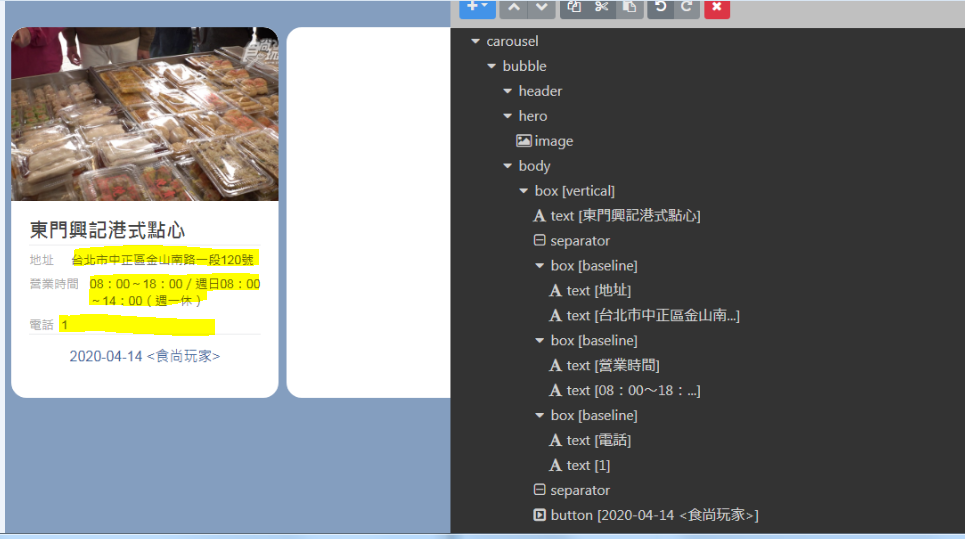

# Flex Message II

參考範例摸索一下,即可建立


建立完之後,仔細觀察content的格式,contents裡面就是儲存多個carousel的地方,因此那個地方需要迴圈產生

```python
    content ={
            "type": "carousel",
            "contents": [
                    {   
                        #carousel 1
                        "type": "bubble",
                            ...
                        "hero": {
                            ....
                        },
                        "body": {
                            ....
                        }
                        ...
                    },
                    {
                        #carousel 2
                        "type": "bubble",
                            ...
                        "hero": {
                            ....
                        },
                        "body": {
                            ....
                        }
                    },
                ]
```

 利用迴圈產生,文字不能空白,如下圖黃色,這邊是在model裡寫方法避免,當然也可以建立時先判斷有無資料,在決定是否加那段文字
 
 
 
```python
def get_flex_content(restaurants):
    contents = []
    for restaurant in restaurants:
        data =  {
                    "type": "bubble",
                    "hero": {
                        "type": "image",
                        "url": restaurant.image_url,
                        "size": "full",
                        "aspectMode": "cover",
                        "aspectRatio": "20:13"
                    },
                    "body": {
                        "type": "box",
                        "layout": "vertical",
                        "contents": [
                            {
                                "type": "text",
                                "text": restaurant.name,
                                "weight": "bold",
                                "wrap": True,
                                "size": "xl"
                            },
                            {
                                "type": "separator"
                            },

                            {
                                "type": "box",
                                "layout": "baseline",
                                "contents": [
                                {
                                    "type": "text",
                                    "text": "地址",
                                    "color": "#aaaaaa",
                                    "size": "sm",
                                    "wrap": True
                                },
                                {
                                    "type": "text",
                                    "text": restaurant.get_address(),
                                    "size": "sm",
                                    "flex": 5,
                                    "color": "#666666"
                                }
                                ],
                                "margin": "md",
                                "spacing": "sm"
                            },
                            {
                                "type": "box",
                                "layout": "baseline",
                                "contents": [
                                {
                                    "type": "text",
                                    "text": "營業時間",
                                    "color": "#aaaaaa",
                                    "size": "sm"
                                },
                                {
                                    "type": "text",
                                    "text": restaurant.get_business_hours(),
                                    "size": "sm",
                                    "color": "#666666",
                                    "wrap": True,
                                    "flex": 3
                                }
                                ],
                                "margin": "md",
                                "spacing": "sm"
                            },
                            {
                                "type": "box",
                                "layout": "baseline",
                                "contents": [
                                {
                                    "type": "text",
                                    "text": "電話",
                                    "color": "#aaaaaa",
                                    "size": "sm"
                                },
                                {
                                    "type": "text",
                                    "size": "sm",
                                    "flex": 7,
                                    "color": "#666666",
                                    "text": restaurant.get_telephone()
                                }
                                ],
                                "margin": "md",
                                "spacing": "sm"
                            },
                            {
                                    "type": "separator"
                            },
                            {
                                    "type": "button",
                                    "action": {
                                    "type": "uri",
                                    "label": restaurant.get_show_name(),
                                    "uri": restaurant.url
                                    },
                                    "position": "relative",
                                    "style": "link",
                                    "flex": 5
                            }
                        ]
                     }
            }
        
        contents.append(data)   
    return contents
```
最後在將內容以FlexSendMessage送出
```python 
def get_restaurant_FlexMessage(restaurants):
    #將JSON設定為變數content，並以FlexSendMessage()包成Flex Message

    contents = get_flex_content(restaurants)
    data = {
            "type": "carousel",
            "contents": contents
                
           }

    message = FlexSendMessage(alt_text='美食資訊',contents=data)
    return message
```
 
注意FlexSendMessage的carousel　最多十筆,line_bot_api.reply_message最多傳送5筆,所以最多可以傳50筆
```python 
def get_restaurant(keyword):
    #抓取前50筆資料
    restaurants = Restaurant.objects.filter(address__icontains = keyword)[0:50]
    #restaurants = Restaurant.objects.filter(address__icontains = keyword)
    if restaurants:      
        #message = get_restaurant_TextMessage(restaurants)
        message = get_restaurant_FlexMessages(restaurants)
    else:
        message = TextSendMessage(text = "沒有資料")
    return message

#加資料裁切成每10筆一份
def get_restaurant_FlexMessages(restaurants):
    messages = []
    if not restaurants:
        return TextSendMessage(text = "沒有資料")
    else:
        for start in range(0,60,10):
            restaurants_slice = restaurants[start :start + 10 ]          
            if restaurants_slice:    
                message = get_restaurant_FlexMessage(restaurants_slice)
                messages.append(message)
            else:
                break
    return messages
```


```
 
 
 
 